This is a **[PyTorch](https://pytorch.org) Tutorial to Sequence Labeling**.

This is the second in a series of tutorials I plan to write about _implementing_ cool models on your own with the amazing PyTorch library.

Basic knowledge of PyTorch, recurrent neural networks is assumed.

If you're new to PyTorch, first read [Deep Learning with PyTorch: A 60 Minute Blitz](https://pytorch.org/tutorials/beginner/deep_learning_60min_blitz.html) and [Learning PyTorch with Examples](https://pytorch.org/tutorials/beginner/pytorch_with_examples.html).

Questions, suggestions, or corrections can be posted as issues.

I'm using `PyTorch 0.4` in `Python 3.6`.

# Contents

[***Objective***](https://github.com/sgrvinod/a-PyTorch-Tutorial-to-Sequence-Labeling#objective)

[***Concepts***](https://github.com/sgrvinod/a-PyTorch-Tutorial-to-Sequence-Labeling#concepts)

[***Overview***](https://github.com/sgrvinod/a-PyTorch-Tutorial-to-Sequence-Labeling#overview)

[***Implementation***](https://github.com/sgrvinod/a-PyTorch-Tutorial-to-Sequence-Labeling#implementation)

[***Training***](https://github.com/sgrvinod/a-PyTorch-Tutorial-to-Sequence-Labeling#training)

[***Frequently Asked Questions***](https://github.com/sgrvinod/a-PyTorch-Tutorial-to-Sequence-Labeling#faqs)

# Objective

**To build a model that can tag each word in a sentence with entities, parts of speech, etc.**


We will be implementing the [_Empower Sequence Labeling with Task-Aware Neural Language Model_](https://arxiv.org/abs/1709.04109) paper. This is more complex than most sequence tagging models, but you will learn many useful concepts – and it works extremely well. The authors' original implementation can be found [here](https://github.com/LiyuanLucasLiu/LM-LSTM-CRF).

This model is special because it augments the sequence labeling task by training it _concurrently_ with language models.

# Concepts

* **Sequence Labeling**. Well, duh.

* **Language Models**. Language Modeling is to predict the next word or character in a sequence of words or characters. Neural language models achieve impressive results across a wide variety of NLP tasks like text generation, machine translation, image captioning, optical character recognition, and what have you.

* **Character RNNs**. RNNs operating on individual characters in a text [are known](http://karpathy.github.io/2015/05/21/rnn-effectiveness/) to capture the underlying style and structure. In a sequence labeling task, they are especially useful since sub-word information can often yield important clues to an entity or tag.

* **Multi-Task Learning**. Datasets available to train a model are often small. Creating annotations or handcrafted features to help your model along is not only cumbersome, but also frequently not adaptable to the diverse domains or settings in which your model may be useful. Sequence labeling, unfortunately, is a prime example. There is a way to mitigate this problem – jointly training multiple models that are joined at the hip will maximize the information available to each model, improving performance.

* **Conditional Random Fields**. Discrete classifiers predict a class or label at a word. Conditional Random Fields (CRFs) can do you one better – they predict labels based on not just the word, but also the neighborhood. Which makes sense, because there _are_ patterns in a sequence of entities or labels. CRFs are widely used to model ordered information, be it for sequence labeling, gene sequencing, or even object detection and image segmentation in computer vision.

* **Viterbi Decoding**. Since we're using CRFs, we're not so much predicting the right label at each word as we are predicting the right label _sequence_ for a word sequence. Viterbi Decoding is a way to do exactly this – find the most optimal tag sequence from the scores computed by a Conditional Random Field.

* **Highway Networks**. Fully connected layers are a staple in any neural network to transform or extract features at different locations. Highway Networks accomplish this, but also allow information to flow unimpeded across transformations. This makes deep networks much more efficient or feasible.

# Overview

In this section, I will present an overview of this model. If you're already familiar with it, you can skip straight to the [Implementation](https://github.com/sgrvinod/a-PyTorch-Tutorial-to-Sequence-Labeling#implementation) section or the commented code.

### LM-LSTM-CRF

The authors refer to the model as the _Language Model - Long Short-Term Memory - Conditional Random Field_ since it involves **co-training language models with an LSTM + CRF combination**.

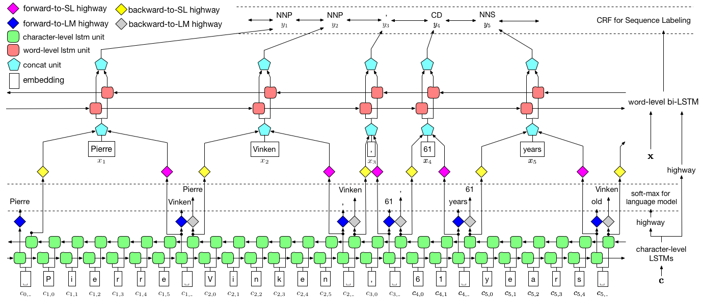

This image from the paper thoroughly represents the entire model, but don't worry if it seems too complex at this time. We'll break it down to take a closer look at the components.

### Multi-Task Learning

**Multi-task learning is when you simultaneously train a model on two or more tasks.**

Usually we're only interested in _one_ of these tasks – in this case, the sequence labeling.

But when layers in a neural network contribute towards performing multiple functions, they learn more than they would have if they had trained only on the primary task. This is because the information extracted at each layer is expanded to accomodate all tasks. When there is more information to work with, **performance on the primary task is enhanced**.

Enriching existing features in this manner removes the need for using handcrafted features for sequence labeling.

The **total loss** during multi-task learning is usually a linear combination of the losses on the individual tasks. The parameters of the combination can be fixed or learned as updateable weights.

<p align="center">

</p>

Since we're aggregating individual losses, you can see how upstream layers shared by multiple tasks would receive updates from all of them during backpropagation.

<p align="center">

</p>

The authors of the paper **simply add the losses** (`β=1`), and we will do the same.

Let's take a look at the tasks that make up our model.

**There are _three_**.

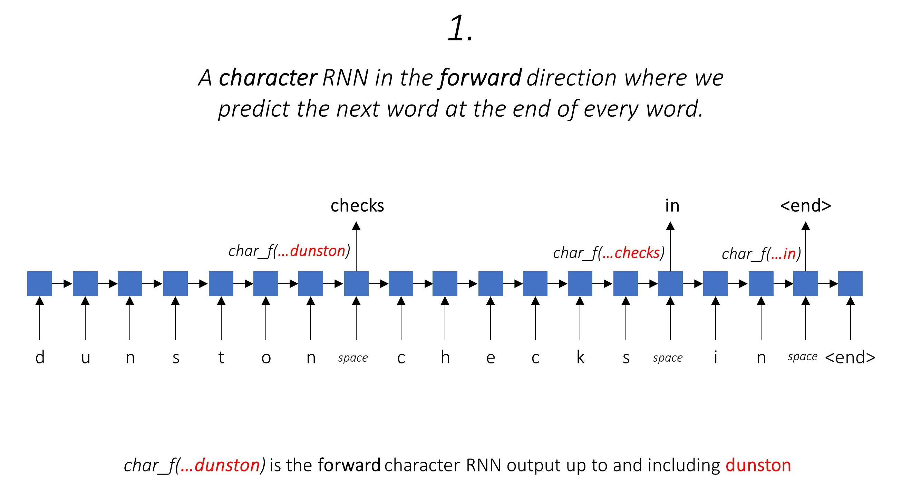

This leverages sub-word information to predict the next word.

We do the same in the backward direction.


We _also_ use the outputs of these two **character-RNNs** as inputs to our **word-RNN** and **Conditional Random Field (CRF)** to perform our primary task of sequence labeling.
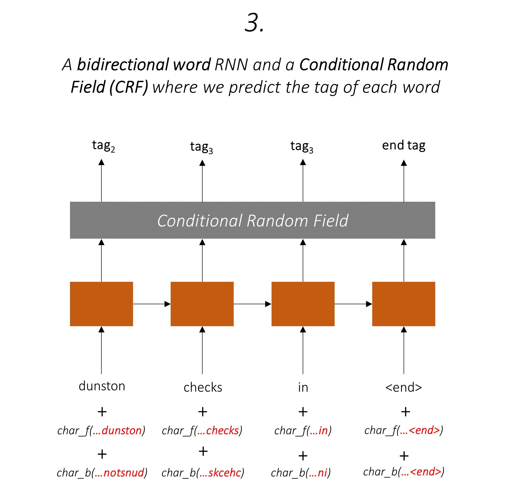

We're using sub-word information in our tagging task because it can be a powerful indicator of the tags, whether they're parts of speech or entities. For example, it may learn that adjectives commonly end with "-y" or "-ul", or that places  often end with "-land" or "-burg".

But our sub-word features, viz. the outputs of the Character RNNs, are also enriched with _additional_ information – the knowledge it needs to predict the next word in both forward and backward directions, because of models 1 and 2.

Therefore, our sequence tagging model uses both
- **word-level information** in the form of word embeddings.
- **character-level information** up to and including each word in both directions, enriched with the know-how required to be able to predict the next word in both directions.

The Bidirectional LSTM/RNN encodes these features into new features at each word containing information about the word and its neighborhood, at both the word-level and the character-level. This forms the input to the Conditional Random Field.

### Conditional Random Field (CRF)

Without a CRF, we would have simply used a single linear layer to transform the output of the Bidirectional LSTM into scores for each tag. These are known as **emission scores**, which are a representation of the likelihood of the word being a certain tag.

A CRF calculates not only the emission scores but also the **transition scores**, which are the likelihood of a word being a certain tag _considering_ the previous word was a certain tag. Therefore the transition scores measure how likely it is to transition from one tag to another.

If there are `m` tags, transition scores are stored in a matrix of dimesions `m, m`, where the rows represent the tag of the previous word and the columns represent the tag of the current word. A value in this matrix at position `i, j` is the **likelihood of transitioning from the `i`th tag at the previous word to the `j`th tag at the current word**. Unlike emission scores, transition scores are not defined for each word in the sentence. They are global.

In our model, the CRF layer outputs the **aggregate of the emission and transition scores at each word**.

For a sentence of length `L`, emission scores would be an `L, m` tensor. Since the emission scores at each word do not depend on the tag of the previous word, we create a new dimension like `L, _, m` and broadcast (copy) the tensor along this direction to get an `L, m, m` tensor.

The transition scores are an `m, m` tensor. Since the transition scores are global and do not depend on the word, we create a new dimension like `_, m, m` and broadcast (copy) the tensor along this direction to get an `L, m, m` tensor.

We can now **add them to get the total scores which are an `L, m, m` tensor**. A value at position `k, i, j` is the _aggregate_ of the emission score of the `j`th tag at the `k`th word and the transition score of the `j`th tag at the `k`th word considering the previous word was the `i`th tag.

For our example sentence `dunston checks in <end>`, if we assume there are 5 tags in total, the total scores would look like this –


But wait a minute, why are there `<start>` end `<end>` tags? While we're at it, why are we using an `<end>` token?

### About `<start>` and `<end>` tags, `<start>` and `<end>` tokens

Since we're modeling the likelihood of transitioning between tags, we also include a `<start>` tag and an `<end>` tag in our tag-set.

The transition score of a certain tag given that the previous tag was a `<start>` tag represents the **likelihood of this tag being the _first_ tag in a sentence**. For example, sentences usually start with articles (a, an, the) or nouns or pronouns.

The transition score of the `<end>` tag considering a certain previous tag indicates the **likelihood of this previous tag being the _last_ tag in a sentence**.

We will use an `<end>` token in all sentences and not a `<start>` token because the total CRF scores at each word are defined with respect to the _previous_ word's tag, which would make no sense at a `<start>` token.

The correct tag of the `<end>` token is always the `<end>` tag. The "previous tag" of the first word is always the `<start>` tag.

To illustrate, if our example sentence `dunston checks in <end>` had the tags `tag_2, tag_3, tag_3, <end>`, the values in red indicate the scores of these tags.


### Highway Networks

We generally use activated linear layers to transform and process outputs of an RNN/LSTM.

If you're familiar with residual connections, we can add the input before the transformation to the transformed output, creating a path for data-flow around the transformation.

<p align="center">

</p>

This path is a shortcut for the flow of gradients during backpropagation, and aids in the convergence of deep networks.

A **Highway Network** is similar to a residual network, but we use a **sigmoid-activated gate to determine the ratio in which the input and transformed output is combined**.

<p align="center">

</p>

Since the character-RNNs contribute towards multiple tasks, **Highway Networks are used for extracting task-specific information** from its outputs.

Therefore, we will use Highway Networks at **three locations** in our combined model –

- to transform the output of the forward character-RNN to predict the next word.
- to transform the output of the backward character-RNN to predict the next word (in the backward direction).
- to transform the concatenated output of the forward and backward character-RNNs for use in the word-level RNN along with the word embedding.

In a naive co-training setting, where we use the outputs of the character-RNNs directly for multiple tasks, i.e. without transformation, the discordance between the nature of the tasks could hurt performance.

### Putting it all together

It might be clear by now what our combined network looks like.

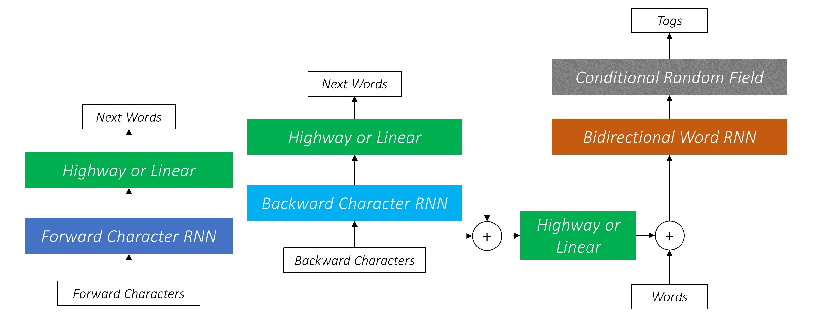

### Other configurations

Progressively removing parts of our network results in progressively simpler networks that are used widely for sequence labeling.

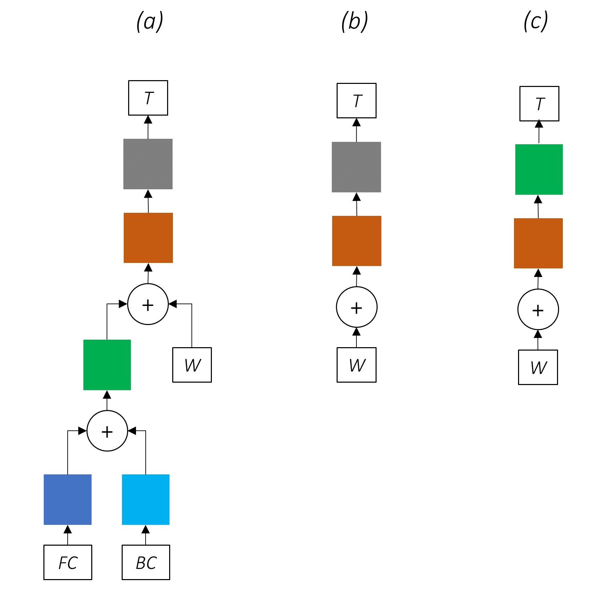

#### (a) a Bi-LSTM + CRF sequence tagger that leverages sub-word information.

There is no multi-task learning.

Using character-level information without co-training still improves performance.

#### (b) a Bi-LSTM + CRF sequence tagger.

There is no multi-task learning or character-level processing.

This configuration is used quite commonly in the industry and works well.

#### (c) a Bi-LSTM sequence tagger.

There is no multi-task learning, character-level processing, or CRFing. Note that a linear or Highway layer would replace the latter.

This could work reasonably well, but a Conditional Random Field provides a sizeable performance boost.

### Viterbi Loss

Remember, we're not using a linear layer that computes only the emission scores. Cross Entropy is not a suitable loss metric.

Instead we will use the **Viterbi Loss** which, like Cross Entropy, is a "negative log likelihood". But here we will measure the likelihood of the gold (true) tag sequence, instead of the likelihood of the true tag at each word in the sequence. To find the likelihood, we consider the softmax over the scores of all tag sequences.

The score of a tag sequence `t` is defined as the sum of the scores of the individual tags.

<p align="center">

</p>

For example, consider the CRF scores we looked at earlier –


The score of the tag sequence `tag_2, tag_3, tag_3, <end> tag` is the sum of the values in red, `4.85 + 6.79 + 3.85 + 3.52 = 19.01`.

**The Viterbi Loss is then defined as**

<p align="center">

</p>

where `t_G` is the gold tag sequence and `T` represents the space of all possible tag sequences.

This simplifies to –

<p align="center">

</p>

Therefore, the Viterbi Loss is the **difference between the log-sum-exp of the scores of all possible tag sequences and the score of the gold tag sequence**, i.e. `log-sum-exp(all scores) - gold score`.

### Viterbi Decoding

**Viterbi Decoding** is a way to construct the most optimal tag sequence, considering not only the likelihood of a tag at a certain word (emission scores), but also the likelihood of a tag considering the previous and next tags (transition scores).

Once you generate CRF scores in a `L, m, m` matrix for a sequence of length `L`, we start decoding.

Viterbi Decoding is best understood with an example. Consider again –


For the first word in the sequence, the `previous_tag` can only be `<start>`. Therefore only consider that one row.

These are also the cumulative scores for each `current_tag` at the first word.


We will also keep track of the `previous_tag` that corresponds to each score. These are known as **backpointers**. At the first word, they are obviously all `<start>` tags.

At the second word, **add the previous cumulative scores to the CRF scores of this word to generate new cumulative scores**.

Note that the first word's `current_tag`s are the second word's `previous_tag`s. Therefore, broadcast the first word's cumulative score along the `current_tag` dimension.

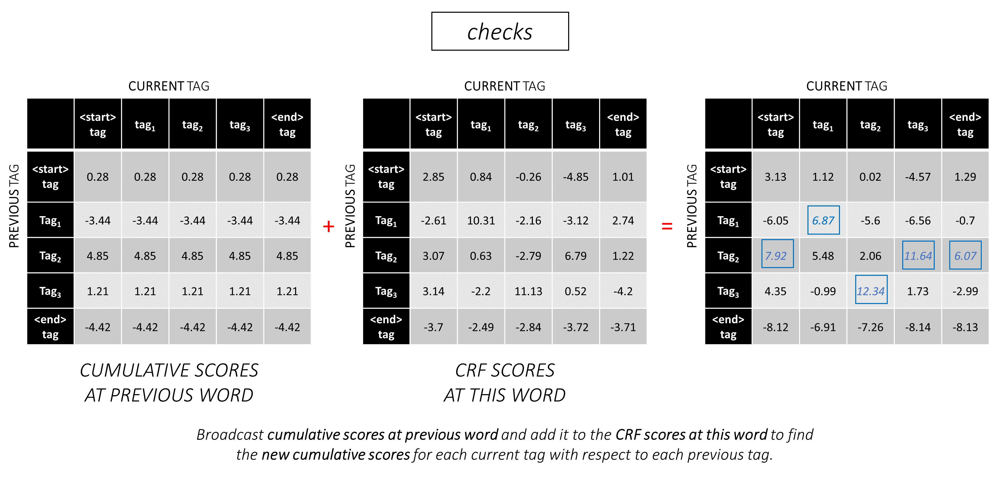

For each `current_tag`, consider only the maximum of the scores from all `previous_tag`s.

Store backpointers, i.e. the previous tags that correspond to these maximum scores.

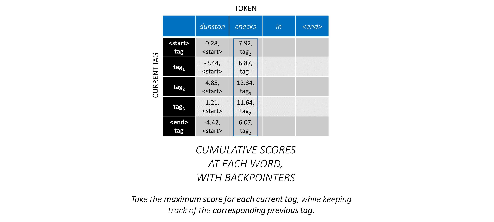

Repeat this process at the third word.


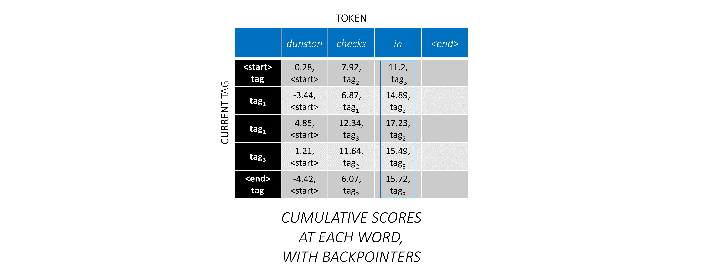

...and the last word, which is the `<end>` token.

Here, the only difference is you _ already know_ the correct tag. You need the maximum score and backpointer **only for the `<end>` tag**.

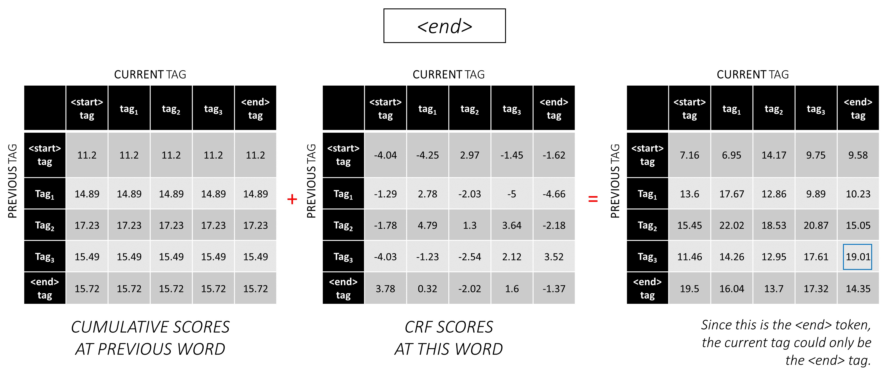
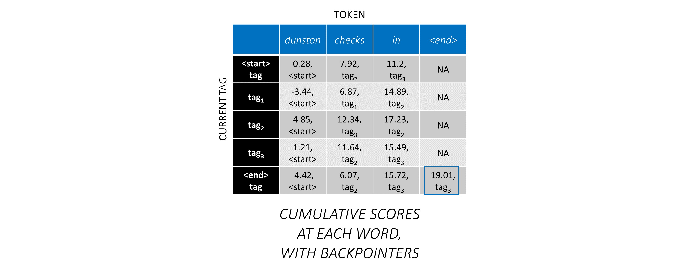

Now that you accumulated CRF scores across the entire sequence, **you trace _backwards_ to reveal the tag sequence with the highest possible score**.


We find that the most optimal tag sequence for `dunston checks in <end>` is `tag_2 tag_3 tag_3 <end>`.

# Implementation

The sections below briefly describe the implementation.

They are meant to provide some context, but **details are best understood directly from the code**, which is quite heavily commented.

### Dataset

I use the CoNLL 2003 NER dataset to compare my results with the paper.

Here's a snippet –

```
-DOCSTART- -X- O O

EU NNP I-NP I-ORG
rejects VBZ I-VP O
German JJ I-NP I-MISC
call NN I-NP O
to TO I-VP O
boycott VB I-VP O
British JJ I-NP I-MISC
lamb NN I-NP O
. . O O
```

This dataset is not meant to be publicly distributed, although you may find it somewhere online.

There are several public datasets online that you can use to train the model. These may not all be 100% human annotated, but they are sufficient.

For NER tagging, you can use the [Groningen Meaning Bank](http://gmb.let.rug.nl/data.php).

For POS tagging, NLTK has a small dataset available you can access with `nltk.corpus.treebank.tagged_sents()`.

You would either have to convert it to the CoNLL 2003 NER data format, or modify the code referenced in the [Data Pipeline](https://github.com/sgrvinod/a-PyTorch-Tutorial-to-Sequence-Labeling#data-pipeline) section.

### Inputs to model

We will need eight inputs.

#### Words

These are the word sequences that must be tagged.

`dunston checks in`

As discussed earlier, we will not use `<start>` tokens but we *will* need to use `<end>` tokens.

`dunston, checks, in, <end>`

Since we pass the sentences around as fixed size Tensors, we need to pad sentences (which are naturally of varying length) to the same length with `<pad>` tokens.

`dunston, checks, in, <end>, <pad>, <pad>, <pad>, ...`

Furthermore, we create a `word_map` which is an index mapping for each word in the corpus, including the `<end>`, and `<pad>` tokens. PyTorch, like other libraries, needs words encoded as indices to look up embeddings for them, or to identify their place in the predicted word scores.

`4381, 448, 185, 4669, 0, 0, 0, ...`

Therefore, **word sequences fed to the model must be an `Int` tensor of dimensions `N, L_w`** where `N` is the batch_size and `L_w` is the padded length of the word sequences (usually the length of the longest word sequence).

#### Characters (Forward)

These are the character sequences in the forward direction.

`'d', 'u', 'n', 's', 't', 'o', 'n', ' ', 'c', 'h', 'e', 'c', 'k', 's', ' ', 'i', 'n', ' '`

We need `<end>` tokens in the character sequences to match the `<end>` token in the word sequences. Since we're going to use character-level features at each word in the word sequence, we need character-level features at `<end>` in the word sequence.

`'d', 'u', 'n', 's', 't', 'o', 'n', ' ', 'c', 'h', 'e', 'c', 'k', 's', ' ', 'i', 'n', ' ', <end>`

We also need to pad them.

`'d', 'u', 'n', 's', 't', 'o', 'n', ' ', 'c', 'h', 'e', 'c', 'k', 's', ' ', 'i', 'n', ' ', <end>, <pad>, <pad>, <pad>, ...`

And encode them with a `char_map`.

`29, 2, 12, 8, 7, 14, 12, 3, 6, 18, 1, 6, 21, 8, 3, 17, 12, 3, 60, 0, 0, 0, ...`

Therefore, **forward character sequences fed to the model must be an `Int` tensor of dimensions `N, L_c`**, where `L_c` is the padded length of the character sequences (usually the length of the longest character sequence).

#### Characters (Backward)

This would be processed the same as the forward sequence, but backward. (The `<end>` tokens would still be at the end, naturally.)

`'n', 'i', ' ', 's', 'k', 'c', 'e', 'h', 'c', ' ', 'n', 'o', 't', 's', 'n', 'u', 'd', ' ', <end>, <pad>, <pad>, <pad>, ...`

`12, 17, 3, 8, 21, 6, 1, 18, 6, 3, 12, 14, 7, 8, 12, 2, 29, 3, 60, 0, 0, 0, ...`

Therefore, **backward character sequences fed to the model must be an `Int` tensor of dimensions `N, L_c`**.

#### Character Markers (Forward)

These markers are **positions in the character sequences** where we extract features to –
- generate the next word in the language models, and
- use as character-level features in the word-level RNN in the sequence labeler

We will extract features at the end of every space `' '` in the character sequence, and at the `<end>` token.

For the forward character sequence, we extract at –

`7, 14, 17, 18`

These are points after `dunston`, `checks`, `in`, `<end>` respectively. Thus, we have **a marker for each word in the word sequence**, which makes sense. (In the language models, however, since we're predicting the _next_ word, we won't predict at the marker which corresponds to `<end>`.)

We pad these with `0`s. It doesn't matter what we pad with as long as they're valid indices. (We will extract features at the pads, but we will not use them.)

`7, 14, 17, 18, 0, 0, 0, ...`

They are padded to the padded length of the word sequences, `L_w`.

Therefore, **forward character markers fed to the model must be an `Int` tensor of dimensions `N, L_w`**.

#### Character Markers (Backward)

For the markers in the backward character sequences, we similarly find the positions of every space `' '` and the `<end>` token.

We also ensure that these **positions are in the same _word_ order as in the forward markers**. This alignment makes it easier to concatenate features extracted from the forward and backward character sequences, and also prevents having to re-order the targets in the language models.

`17, 9, 2, 18`

These are points after `notsnud`, `skcehc`, `ni`, `<end>` respectively.

We pad with `0`s.

`17, 9, 2, 18, 0, 0, 0, ...`

Therefore, **backward character markers fed to the model must be an `Int` tensor of dimensions `N, L_w`**.

#### Tags

Let's assume the correct tags for `dunston, checks, in, <end>` are –

`tag_2, tag_3, tag_3, <end>`

We have a `tag_map` (containing the tags `<start>`, `tag_1`, `tag_2`, `tag_3`,  `<end>`).

Normally, we would just encode them directly (before padding) –

`2, 3, 3, 5`

These are `1D` encodings, i.e., tag positions in a `1D` tag map.

But the **outputs of the CRF layer are `2D` `m, m` tensors** at each word. We would need to encode tag positions in these `2D` outputs.


The correct tag positions are marked in red.

`(0, 2), (2, 3), (3, 3), (3, 4)`

If we unroll these scores into a `1D` `m*m` tensor, then the tag positions in the unrolled tensor would be

```python
tag_map[previous_tag] * len(tag_map) + tag_map[current_tag]
```

Therefore, we encode `tag_2, tag_3, tag_3, <end>` as

`2, 13, 18, 19`

Note that you can retrieve the original `tag_map` indices by taking the modulus

```python
t % len(tag_map)
```

They will be padded to the padded length of the word sequences, `L_w`.

Therefore, **tags fed to the model must be an `Int` tensor of dimensions `N, L_w`**.

#### Word Lengths

These are the actual lengths of the word sequences including the `<end>` tokens. Since PyTorch supports dynamic graphs, we will compute only over these lengths and not over the `<pads>`.

Therefore, **word lengths fed to the model must be an `Int` tensor of dimensions `N`**.

#### Character Lengths

These are the actual lengths of the character sequences including the `<end>` tokens. Since PyTorch supports  dynamic graphs, we will compute only over these lengths and not over the `<pads>`.

Therefore, **character lengths fed to the model must be an `Int` tensor of dimensions `N`**.

### Data Pipeline

See `read_words_tags()` in [`utils.py`](https://github.com/sgrvinod/a-PyTorch-Tutorial-to-Sequence-Labeling/blob/master/utils.py).

This reads the input files in the CoNLL 2003 format, and extracts the word and tag sequences.

See `create_maps()` in [`utils.py`](https://github.com/sgrvinod/a-PyTorch-Tutorial-to-Sequence-Labeling/blob/master/utils.py).

Here, we create encoding maps for words, characters, and tags. We bin rare words and characters as `<unk>`s (unknowns).

See `create_input_tensors()` in [`utils.py`](https://github.com/sgrvinod/a-PyTorch-Tutorial-to-Sequence-Labeling/blob/master/utils.py).

We generate the eight inputs detailed in the [Inputs to Model](https://github.com/sgrvinod/a-PyTorch-Tutorial-to-Sequence-Labeling#inputs-to-model) section.

See `load_embeddings()` in [`utils.py`](https://github.com/sgrvinod/a-PyTorch-Tutorial-to-Sequence-Labeling/blob/master/utils.py).

We load pre-trained embeddings, with the option to expand the `word_map` to include out-of-corpus words present in the embedding vocabulary. Note that this may also include rare in-corpus words that were binned as `<unk>`s earlier.

See `WCDataset` in [`datasets.py`](https://github.com/sgrvinod/a-PyTorch-Tutorial-to-Sequence-Labeling/blob/master/datasets.py).

This is a subclass of PyTorch [`Dataset`](https://pytorch.org/docs/master/data.html#torch.utils.data.Dataset). It needs a `__len__` method defined, which returns the size of the dataset, and a `__getitem__` method which returns the `i`th set of the eight inputs to the model.

The `Dataset` will be used by a PyTorch [`DataLoader`](https://pytorch.org/docs/master/data.html#torch.utils.data.DataLoader) in `train.py` to create and feed batches of data to the model for training or validation.

### Highway Networks

See `Highway` in [`models.py`](https://github.com/sgrvinod/a-PyTorch-Tutorial-to-Sequence-Labeling/blob/master/models.py).

A **transform** is a ReLU-activated linear transformation of the input. A **gate** is a sigmoid-activated linear transformation of the input. Note that **both transformations must be the same size as the input**, to allow for adding the input in a residual connection.

The `num_layers` attribute specifices how many transform-gate-residual-connection operations we perform in series. Usually just one is sufficient.

We store the requisite number of transform and gate layers in separate `ModuleList()`s, and use a `for` loop to perform successive operations.  

### Language Models

See `LM_LSTM_CRF` in [`models.py`](https://github.com/sgrvinod/a-PyTorch-Tutorial-to-Sequence-Labeling/blob/master/models.py).

At the very outset, we **sort the forward and backward character sequences by decreasing lengths**. This is required to use [`pack_padded_sequence()`](https://pytorch.org/docs/master/nn.html#torch.nn.utils.rnn.pack_padded_sequence) in order for the LSTM to compute over only the valid timesteps, i.e. the true length of the sequences.

Remember to also sort all other tensors in the same order.

See [`dynamic_rnn.py`](https://github.com/sgrvinod/a-PyTorch-Tutorial-to-Sequence-Labeling/blob/master/dynamic_rnn.py) for an illustration of how `pack_padded_sequence()` can be used to take advantage of PyTorch's dynamic graphing and batching capabilities so that we don't process the pads. It flattens the sorted sequences by timestep while ignoring the pads, and the **LSTM computes over only the effective batch size `N_t` at each timestep**.

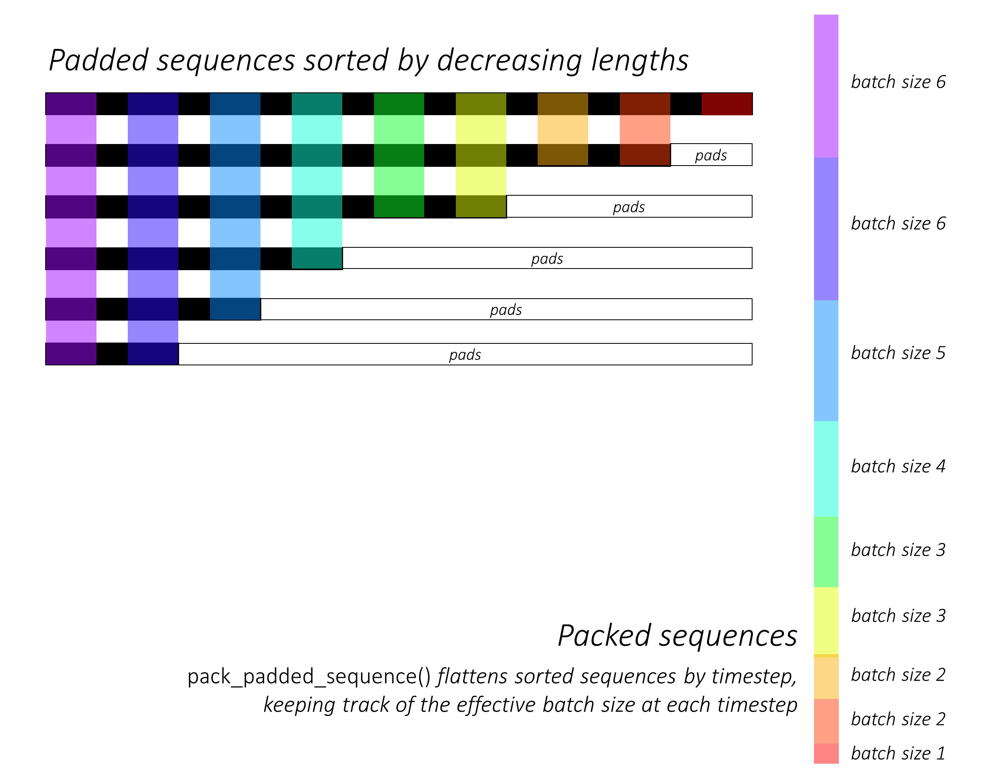

The **sorting allows the top `N_t` at any timestep to align with the outputs from the previous step**. At the third timestep, for example, we process only the top 5 images, using the top 5 outputs from the previous step. Except for the sorting, all of this is handled internally by PyTorch, but it's still very useful to understand what `pack_padded_sequence()` does so we can use it in other scenarios to achieve similar ends. (See the related question about handling variable length sequences in the [FAQs](https://github.com/sgrvinod/a-PyTorch-Tutorial-to-Sequence-Labeling#faqs) section.)

Upon sorting, we **apply the forward and backward LSTMs on the forward and backward `packed_sequences`** respectively. We use [`pad_packed_sequence()`](https://pytorch.org/docs/master/nn.html#torch.nn.utils.rnn.pad_packed_sequence) to unflatten and re-pad the outputs.

We **extract only the outputs at the forward and backward character markers** with [`gather`](https://pytorch.org/docs/master/torch.html#torch.gather). This function is very useful for extracting only certain indices from a tensor that are specified in a separate tensor.

These **extracted outputs are processed by the forward and backward Highway layers** before applying a **linear layer to compute scores over the vocabulary** for predicting the next word at each marker. We do this only during training, since it makes no sense to perform language modeling for multi-task learning during validation or inference. The `training` attribute of any model is set with `model.train()` or `model.eval()` in `train.py`. (Note that this is primarily used to enable or disable dropout and batch-norm layers in a PyTorch model during training and inference respectively.)

### Sequence Labeling Model

See `LM_LSTM_CRF` in [`models.py`](https://github.com/sgrvinod/a-PyTorch-Tutorial-to-Sequence-Labeling/blob/master/models.py) (continued).

We also **sort the word sequences by decreasing lengths**, because there may not always be a correlation between the lengths of the word sequences and the character sequences.

Remember to also sort all other tensors in the same order.

We **concatenate the forward and backward character LSTM outputs at the markers, and run it through the third Highway layer**. This will extract the sub-word information at each word which we will use for sequence labeling.

We **concatenate this result with the word embeddings, and compute BLSTM outputs** over the `packed_sequence`.

Upon re-padding with `pad_packed_sequence()`, we have the features we need to feed to the CRF layer.

### Conditional Random Field (CRF)

See `CRF` in [`models.py`](https://github.com/sgrvinod/a-PyTorch-Tutorial-to-Sequence-Labeling/blob/master/models.py).

You may find this layer is surprisingly straightforward considering the value it adds to our model.

A linear layer is used to transform the outputs from the BLSTM to scores for each tag, which are the **emission scores**.

A single tensor is used to hold the **transition scores**. This tensor is a [`Parameter`](https://pytorch.org/docs/master/nn.html#torch.nn.Parameter) of the model, which means it is updateable during backpropagation, just like the weights of the other layers.

To find the CRF scores, **compute the emission scores at each word and add it to the transition scores**, after broadcasting both as described in the [CRF Overview](https://github.com/sgrvinod/a-PyTorch-Tutorial-to-Sequence-Labeling#conditional-random-field-crf).

### Viterbi Loss

See `ViterbiLoss` in [`models.py`](https://github.com/sgrvinod/a-PyTorch-Tutorial-to-Sequence-Labeling/blob/master/models.py).

We established in the [Viterbi Loss Overview](https://github.com/sgrvinod/a-PyTorch-Tutorial-to-Sequence-Labeling#viterbi-loss) that we want to minimize the **difference between the log-sum-exp of the scores of all possible valid tag sequences and the score of the gold tag sequence**, i.e. `log-sum-exp(all scores) - gold score`.

We sum the CRF scores of each true tag as described earlier to calculate the **gold score**.

Remember how we encoded tag sequences with their positions in the unrolled CRF scores? We extract the scores at these positions with `gather()` and eliminate the pads with `pack_padded_sequences()` before summing.

Finding the **log-sum-exp of the scores of all possible sequences** is slightly trickier. We use a `for` loop to iterate over the timesteps. At each timestep, we **accumulate scores for each `current_tag`** by –

- **adding the CRF scores at this timestep to the accumulated scores from the previous timestep** to find the accumulated score for each `current_tag` for each `previous_tag`. We do this at only the effective batch size, i.e. for sequences that haven't completed yet. (Our sequences are still sorted by decreasing word lengths, from the `LM-LSTM-CRF` model.)
- **for each `current_tag`, compute the log-sum-exp over the `previous_tag`s** to find the new accumulated scores at each `current_tag`.

After computing over the variable lengths of all sequences, we are left with a tensor of dimensions `N, m`, where `m` is the number of (current) tags. These are the log-sum-exp accumulated scores over all possible sequences ending in each of the `m` tags. However, since valid sequences can only end with the `<end>` tag, **sum over only the `<end>` column to find the log-sum-exp of the scores of all possible valid sequences**.

We find the difference, `log-sum-exp(all scores) - gold score`.

### Viterbi Decoding

See `ViterbiDecoder` in [`inference.py`](https://github.com/sgrvinod/a-PyTorch-Tutorial-to-Sequence-Labeling/blob/master/inference.py).

This implements the process described in the [Viterbi Decoding Overview](https://github.com/sgrvinod/a-PyTorch-Tutorial-to-Sequence-Labeling#viterbi-decoding).

We accumulate scores in a `for` loop in a manner similar to what we did in `ViterbiLoss`, except here we **find the maximum of the `previous_tag` scores for each `current_tag`**, instead of computing the log-sum-exp. We also **keep track of the `previous_tag` that corresponds to this maximum score** in a backpointer tensor.

We **pad the backpointer tensor with `<end>` tags** because this allows us to trace backwards over the pads, eventually arriving at the _actual_ `<end>` tag, whereupon the _actual_ **backtracing** begins.

# Training

See `train.py`.

### Trimming Batch Inputs

You will notice we **trim the inputs at each batch to the maximum sequence lengths in that batch**. This is so we don't have more pads in each batch that we actually need.

But why? Although the RNNs in our model don't compute over the pads, **the linear layers still do**. It's pretty straightward to change this – see the related question about handling variable length sequences in the [FAQs](https://github.com/sgrvinod/a-PyTorch-Tutorial-to-Sequence-Labeling#faqs) section.

For this tutorial, I figured a little extra computation over some pads was worth the straightforwardness of not having to perform a slew of operations – Highway, CRF, other linear layers, concatenations – on a `packed_sequence`.

### Loss

In the multi-task scenario, we have chosen to sum the Cross Entropy losses from the two language modelling tasks and the Viterbi Loss from the sequence labeling task.  

Even though we are **minimizing the sum of these losses**, we are actually only interested in minimizing the Viterbi Loss _by virtue of minimizing the sum of these losses_. It is the Viterbi Loss which reflects performance on the primary task.

We use `pack_padded_sequence()` to eliminate pads wherever necessary.

### F1 Score

Like in the paper, we use the **macro-averaged F1 score as the criterion for early-stopping**. Naturally, computing the F1 score requires Viterbi Decoding the CRF scores to generate our optimal tag sequences.

We use `pack_padded_sequence()` to eliminate pads wherever necessary.

### Remarks

I have followed the parameters in the authors' implementation as closely as possible.

I used a batch size of `10` sentences. I employed Stochastic Gradient Descent with momentum. The learning rate was decayed every epoch. I used 100D [GloVe](https://nlp.stanford.edu/projects/glove/) pretrained embeddings without fine-tuning.

It took about 80s to train one epoch on a Titan X (Pascal).

The F1 score on the validation set hit `91%` around epoch 50, and peaked at `91.6%` on epoch 171. I ran it for a total of 200 epochs. This is pretty close to the results in the paper.

### Model Checkpoint

You can download this pretrained model [here](https://drive.google.com/open?id=1P-w-s6QbsixcGnm3UjPMkgGpuz684kiY).

# FAQs

__How do we decide if we need `<start>` and `<end>` tokens for a model that uses sequences?__

If this seems confusing at first, it will easily resolve itself when you think about the requirements of the model you are planning to train.

For sequence labeling with a CRF, you need the `<end>` token (_or_ the `<start>` token; see next question) because of how the CRF scores are structured.

In my other tutorial on image captioning, I used _both_ `<start>` and `<end>` tokens. The model needed to start decoding _somewhere_, and learn to recognize _when_ to stop decoding during inference.

If you're performing text classification, you would need neither.

---

__Can we have the CRF generate `current_word -> next_word` scores instead of `previous_word -> current_word` scores?__

Yes. In this case you would broadcast the emission scores like `L, m, _`, and you would have a `<start>` token in every sentence instead of an `<end>` token. The correct tag of the `<start>` token would always be the `<start>` tag. The "next tag" of the last word would always be the `<end>` tag.

I think the `previous word -> next word` convention is slightly better because there are language models in the mix. It fits in quite nicely to be able to predict the `<end>` token at the last real word, and therefore learn to recognize when a sentence is complete.

---

__Why are we using different vocabularies for the sequence tagger's inputs and language models' outputs?__

The language models will learn to predict only those words it has seen during training. It's really unnecessary, and a huge waste of computation and memory, to use a linear-softmax layer with the extra ~400,000 out-of-corpus words from the embedding file it will never learn to predict.

But we _can_ add these words to the input layer even if the model never sees them during training. This is because we're using pre-trained embeddings at the input. It doesn't _need_ to see them because the meanings of words are encoded in these vectors. If it's encountered a `chimpanzee` before, it very likely knows what to do with an `orangutan`.

---

__Is it a good idea to fine-tune the pre-trained word embeddings we use in this model?__

I refrain from fine-tuning because most of the input vocabulary is not in-corpus. Most embeddings will remain the same while a few are fine-tuned. If fine-tuning changes these embeddings sufficiently, the model may not work well with the words that weren't fine-tuned. In the real world, we're bound to encounter many words that weren't present in a newspaper corpus from 2003.

---

__What are some ways we can construct dynamic graphs in PyTorch to compute over only the true lengths of sequences?__

If you're using an RNN, simply use [`pack_padded_sequence()`](https://pytorch.org/docs/master/nn.html#torch.nn.utils.rnn.pack_padded_sequence). PyTorch will internally compute over only the true lengths. See [`dynamic_rnn.py`](https://github.com/sgrvinod/a-PyTorch-Tutorial-to-Sequence-Labeling/blob/master/dynamic_rnn.py) for an example.

If you want to execute an operation (like a linear transformation) only on the true timesteps, `pack_padded_sequences()` is still the way to go. This flattens the tensor by timestep while removing the pads. You can perform your operation on this flattened tensor, and then use [`pad_packed_sequence()`](https://pytorch.org/docs/master/nn.html#torch.nn.utils.rnn.pad_packed_sequence) to unflatten it and re-pad it with `0`s.

Similarly, if you want to perform an aggregation operation, like computing the loss, use `pack_padded_sequences()` to eliminate the pads.

If you want to perform timestep-wise operations, you can take a leaf out of how `pack_padded_sequences()` works, and compute only on the effective batch size at each timestep with a `for` loop to iterate over the timesteps. We did this in the `ViterbiLoss` and `ViterbiDecoder`. I also used an `LSTMCell()` in this fashion in my image captioning tutorial.

---

__*Dunston Checks In*? Really?__

I had no memory of this movie for twenty years. I was trying to think of a short sentence that would be easier to visualize in this tutorial and it just popped into my mind riding a wave of 90s nostalgia.

<p align="center">

</p>

I wish I hadn't googled it though. Damn, the critics were harsh, weren't they? This gem was overwhelmingly and universally panned. I'm not sure I'd disagree if I watched it now, but that just goes to show the world is so much more fun when you're a kid.

Didn't have to worry about LM-LSTM-CRFs or nuthin...
